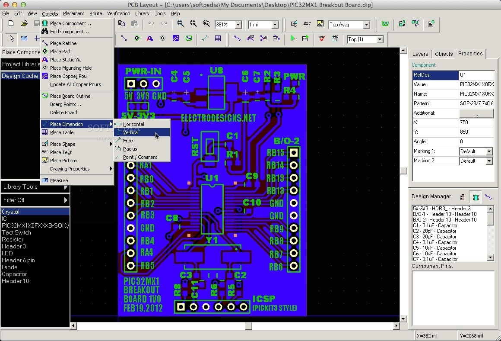

# Get to Know DipTrace

## Introduction

Thanks for coming to Fleming Society’s Intro to DipTrace and PCB Design Workshop.

The workshop is designed to introduce you to working in DipTrace before you get thrown into the deep end during scenarios, where many students find themselves spending too much time having to get to grips with DipTrace.

This workshop will be largely self-guided through the use of this lab script, by the end of which you will have designed a simple LM555 timer circuit that blinks an LED.

If you get stuck, don’t hesitate to ask.

If you need to see a bigger version of the images, simply click on them and they'll open in a new tab.

## The General PCB Design Project

The steps below highlight the general process of creating a PCB:

- Create a footprint of all the components and make a schematic by using schematic capture
- Set design rules
- Place and route all parts
- Pour ground planes connected to the ground nets
- Run connection checks
- Generate files for the board fabrication

## Part 1: Schematic Capture

Open up the DipTrace Launcher and select ‘Schematic Capture’.

You will be presented with this window:

On your left, from top to bottom, you have: 
	
- Component libraries. The discrete SMD library is one you will be using a lot as it contains the 0805-package type surface mount devices (SMD) you will be using for your scenario.
-	The box below allows you to browse through the selected library’s components.
-	Below that, you have the symbolic representation of the component, followed by its PCB footprint. The footprint is what will actually go on the PCB, as such, it is important every part you use has a footprint.

The blue rectangle is the properties window. Here you can change the properties of any selected component.
The green rectangle is where your tools are. The blue IC picture is the ‘place component’ button and two spaces to the right is your ‘place wire button’.

### Step 1

Click on ‘place component’ and using the filter search for LM555. Make sure to set the search are to all libraries.

Select the LM555CM. Click on display pattern: when you browse through the other LM555’s you will notice that only the LM555CM is a surface mount device, as shown by its PCB footprint.

Place the LM555CM.

### Step 2

Find and place the rest of the components as shown in the circuit above, anywhere on the sheet. Then, go ahead and label all your components. Use package type 0805 components from the discrete SMD library. For the LED, select a LED-8R component. (This is a through hole component)

When clicking on a component, under properties, you can change various qualities of your component, such as the value and name.

Changing the marking of a component to its value can help you better keep track of things. A second marking is also available if you need it.

### Step 3

Under the symbol library, you can find things like ground and vcc. Place them as well. 

### Step 4

Position the components accordingly, and simply click and connect the components to their connections.

Space rotates components. Top bar you have the mouse pointer for component selections and a ‘place wire’ for component connections.

Right click -> replace part is a useful tool for quickly replacing components.

You can also name nets. Right click on a net, properties, name. VCC, GND and OUTPUT. Helps organization.

### Step 5

Save. Run an electrical rules check. You can find it under the “Verification” menu.

Electrical rule setup will show you potential problems.

Right clicking on a component, properties, attached pattern, will show you the footprint the components have. Each component needs one for proper conversion to a PCB.

### Step 6

Convert to PCB by going into the "File" menu and clicking the "Convert to PCB" option, or by simply using the Ctrl+B shortcut. In this step, you'll need to use the schematic rules (if you have them).

## Part 2: PCB Layout

Now you are on the PCB Design stage. The blueish-purple lines are called ratlines. These help with routing. They readjust themselves when you move parts and tell you what should be connected to what.

Open verification -> Design rule setup. Here you can input all the design rules that will be given to you before the scenario. Make sure these are correct before you start designing your PCB to avoid extra work.

### Step 1

Now, arrange your parts in a “pleasing” manner. Attempt to have the fewest crossing ratlines as possible. Straight lines are best. Remember about rotating parts with the space button.

Hovering over pins on the IC will tell you what each one is and how they are connected.

### Step 2

Add in a connector (or header). This will be for power. Your PCB will use different connections for power so do check with lab technicians/PGTAs.

Put things rather close, but not too close.

### Step 3

Now you can start adding routing. Top bar - mouse over things to tell you what they are. Select Route Manual. Avoid right angles when creating your copper tracks.

### Step 4

Now go objects -> place dimension. Use vertical and horizontal dimension to draw the size of your board outline.
‘Place Board Outline’, is 3 spaces left of ‘route manual’. Place an outline around your components.

***NOTE: The lab has strict requirements as to what size of PCB you can make. Consult lab technicians and PGTAs on sizing, track width, hole width, etc (all design rules) before you start your design.***

### Step 5

Object -> place mounting hole.
These go in all four corners of your board. Place one, right click on it, set its properties as defined in your designs.

Copy and paste it to all four corners of the board. Now you have the same sized mounting hole on your board.

### Step 6

In the top bar, you can see two text boxes relating to the side of the PCB. 

Top Side, and Top (1).

With Top Side selected, everything you place, will place on the top side of the PCB. With Bottom Side selected, everything you place will place on the Bottom side of the PCB.

Top (1) views the top side, and Bottom (2) views the bottom side.

***NOTE: You can have Top Side selected, and have Bottom (2) selected, and you will be placing components on the top side while viewing the bottom side. Be careful.***

### Step 7

Placing copper pour. 

Do so on the bottom to have a ground plane. This is like placing an outline, but everything inside will be filled in by a copper pour. Check the connectivity tab to connect to make sure it’s connected to GND. *Design rules are important here. Spacing and track width, hole diameter will all impact your PCB. Make sure these are correct.*

Congrats! You now have a completed PCB Design!

You can now continue exploring DipTrace if you'd like. If you want, you can get an offline copy of this script by clicking the button below.

<button class="mdc-button mdc-button--raised">
  <a href="./files/diptrace_script.pdf" class="mdc-button__label" style="text-decoration: none;" download>Download the Script</a>
</button>

