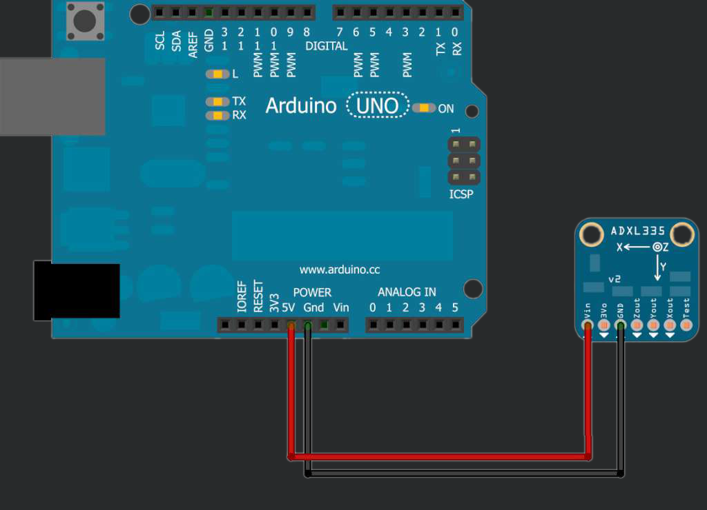
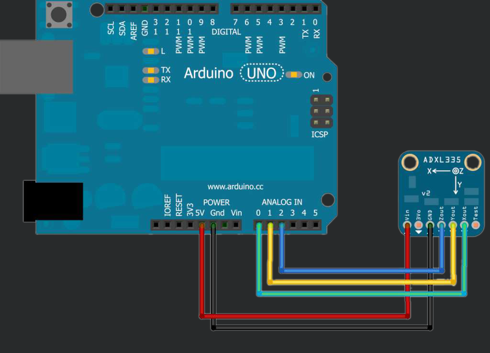
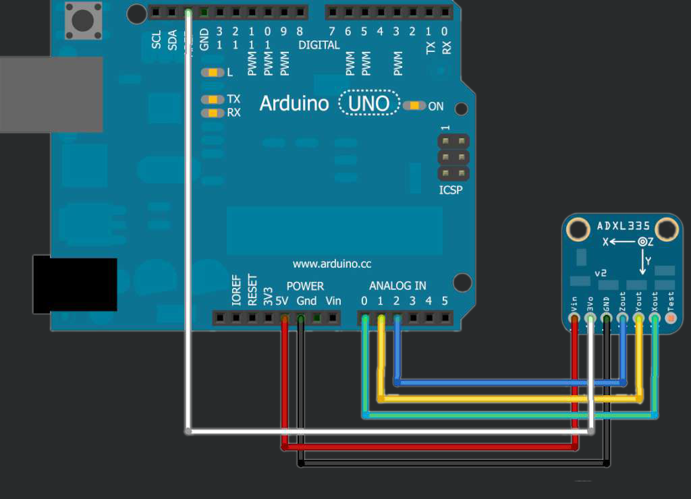
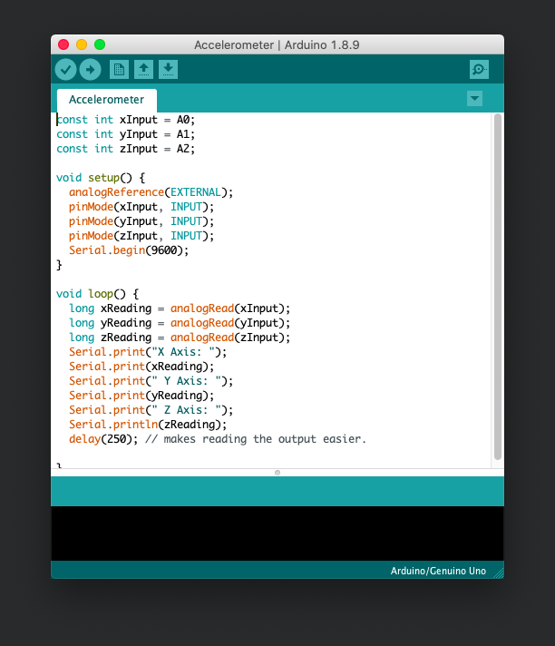

## Overview
The ADXL335 is a low-power 3-axis MEMS accelerometer. It can measure at least 3G in the X, Y and Z axis, making it great if you want to sense tilt or you want to measure how fast a person is walking.

## What is MEMS?
MEMS stands for Micro Electro-Mechanical System. The sensor consists of a micro-machined structure on a silicon wafer. The structure is suspended by polysilicon springs which allow it to deflect in the when subject to acceleration in the X, Y and/or Z axis. Deflection causes a change in capacitance between fixed plates and plates attached to the suspended structure. This change in capacitance on each axis is converted to an output voltage proportional to the acceleration on that axis.

## Wiring
Start by connecting the power, as seen in the diagram below:

**REMEMBER! ALWAYS DISCONNECT THE ARDUINO FROM THE PC WHEN CHANGING WIRES.**

You can now proceed to connect the X, Y and Z signal outputs to the analog pins on the Arduino, as shown below:

Finally, you can use the board's voltage regulator as Arduino's Analog Reference (AREF). This is not strictly necessary, but it does help in improving the accuracy and precision of the accelerometer:

To recap, the following table shows the connections you need to make:

| Accelerometer | Arduino |
| ----------------- | ------- |
| Vin | 5V |
| 3Vo | AREF |
| GND | GND |
| Zout | A2 |
| Yout | A1 |
| Xout | A0 |
| Test | Unused |

## Getting Ready To Code
For this sensor there is no need to install any libraries! Look through the tutorial code and you will pick it up quickly. 

It uses only two functions. One to set the analogue pin to an input and another to read its value.

Simples.

***

Congrats! You are now ready to tackle the tutorial code.

<button class="mdc-button mdc-button--raised">
  <a href="./code/Accelerometer.ino" class="mdc-button__label" style="text-decoration: none;" download>Download the Code</a>
</button>

***