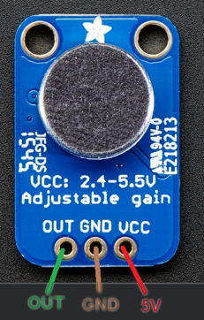

## Overview
Need to measure how loud the environment is? Then this is your sensor. You are limited with the processing power of the Arduino and so doing any voice recognition is very unlikely! However, if you want to measure when the loudness goes above a threshold this is a good choice. 

This sensor uses analogue signals so watch out! You have to connect it to an analogue pin. These are titled A0 to A15 so you have plenty to choose from!

## Wiring
To wire the microphone up we have to connect the power supply and the connection that is used to send data between the microphone and the Arduino. 

**REMEMBER ALWAYS DISCONNECT THE ARDUINO FROM THE PC WHEN CHANGING WIRES.**

The following table shows the connections you need to make:

| Microphone    | Arduino |
| ------------- | ------- |
| OUT           | Pin A0  |
| GND           | GND     |
| 5V            | 5V      |

The Microphone OUT port can use any analogue pin on the Arduino (A0 -> A15)!

## Getting Ready To Code

For this sensor there is no need to install any libraries! Look through the tutorial code and you will pick it up quickly. It uses only two functions. One to set the analogue pin to an input and another to read its value. 

Simples. 

***

Congrats! You are now ready to tackle the tutorial code.

<button class="mdc-button mdc-button--raised">
  <a href="https://raw.githubusercontent.com/nicogig/fleming_crate/master/Project_X/microphone/MicTutorial.ino" class="mdc-button__label" style="text-decoration: none;" download>Download the Code</a>
</button>

***