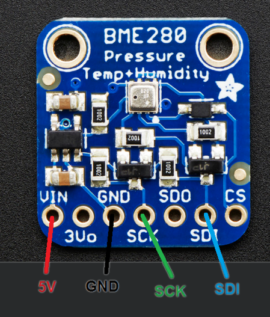
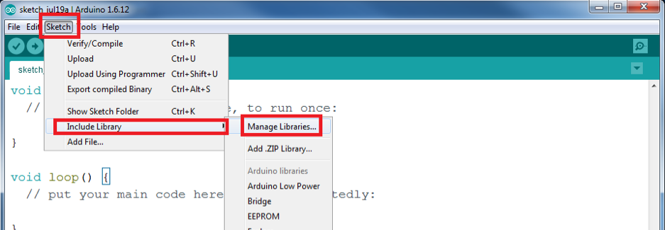
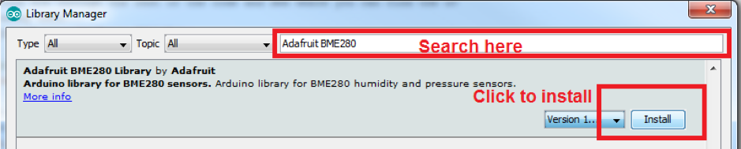
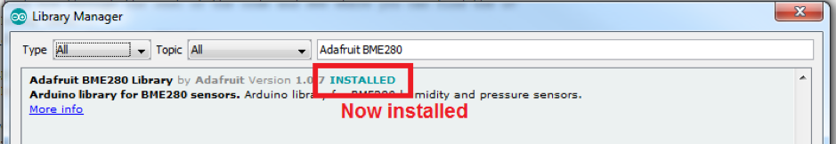
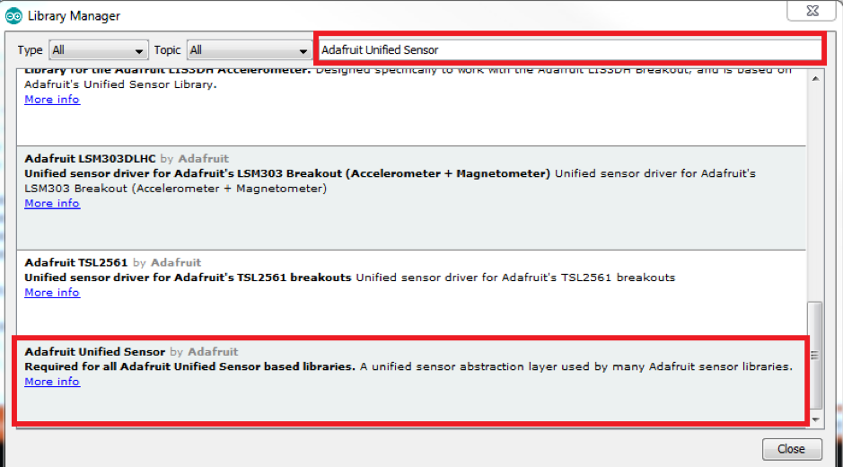

## Overview
This sensor is an environmental sensor that monitors temperature, humidity and air pressure.

## Wiring
To wire the sensors up we have to connect the power supply for the sensor and the connections that are used to send data between the sensor and the Arduino.

**REMEMBER! ALWAYS DISCONNECT THE ARDUINO FROM THE PC WHEN CHANGING WIRES.**

The following table shows the connections you need to make:

| BME280 Sensor | Arduino |
| ------------- | ------- |
| GND           | GND     |
| VIN / 5V      | 5V      |
|SCK|SCL|
|SDI|SDA|

## Getting Ready To Code

First we need to install the library for the sensor if it is not already installed. To do this open the Library Manager by clicking “Sketch>Include Library>Manage Libraries…”

Using the search box in the top right hand corner of the window that has popped up search for “Adafruit BME280”. It may already be installed but if not click the install button.

Once the install is complete it should now say the library is installed as shown below. 

Next you have to install a second library called “Adafruit Unified Sensor”. Search for it as you did before and then scroll to the bottom until you find the correct library as shown in the image below.

Once this is all installed you can now download the demo code from our website and begin working out how to use the sensor!

***

Congrats! You are now ready to tackle the tutorial code.

<button class="mdc-button mdc-button--raised">
  <a href="./code/TempPressHumidTutorial.ino" class="mdc-button__label" style="text-decoration: none;" download>Download the Code</a>
</button> 

***