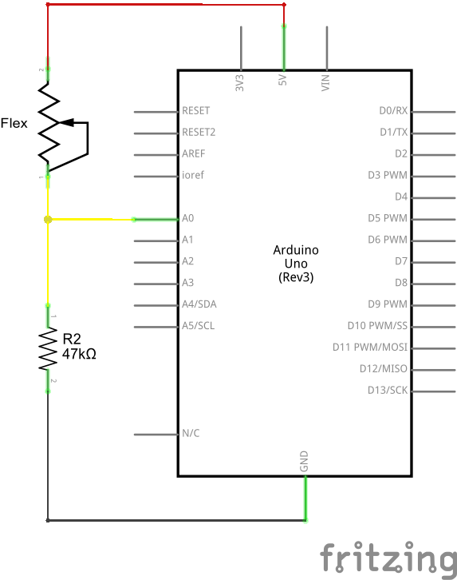

## Overview
Before we get to circuit-building and Arduino-programming, here’s a quick rundown of the flex sensor’s important electrical characteristics.

## How It Works
One side of the sensor is printed with a polymer ink that has conductive particles embedded in it. When the sensor is straight, the particles give the ink a resistance of about 30k Ohms. When the sensor is bent away from the ink, the conductive particles move further apart, increasing this resistance (to about 50k-70K Ohms when the sensor is bent to 90°, as in the diagram below).

When the sensor straightens out again, the resistance returns to the original value. By measuring the resistance, you can determine how much the sensor is being bent.

The flex sensor is designed to be flexed in just one direction – away from the ink – as demonstrated in the image below.

Bending the sensor in the other direction will not produce any reliable data, and may damage the sensor. Also take care not to bend the sensor close to the base, as they have a tendency to kink and fail.

## Example Circuit

The simplest way to incorporate this sensor into your project is by using it in a voltage divider. This circuit requires one resistor. Many values from 10KΩ to 100KΩ will work. If you have a resistor kit, you may want to introduce some trial-and-error to hone in on that perfect static resistance.

A value between the minimum and maximum resistance values is usually a good choice. We’ll use a 47kΩ resistor in this example. Here’s the hookup:

And a schematic:

The 47kΩ resistor on the ground side, and the flex sensor on the 5V side, means as the flex sensor’s resistance increases (meaning the sensor is bending) the voltage on A0 will decrease.

***

Congrats! You have finished this tutorial.

***
