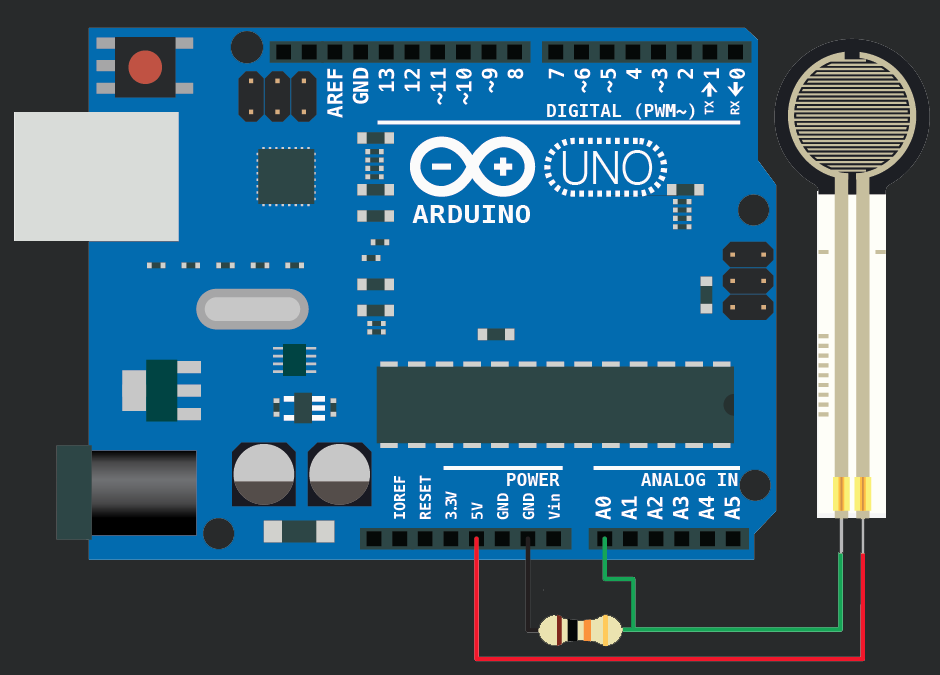

## Overview
The Force Sensitive Resistor, or FSR is one of those parts that fills bins in interaction design labs across the world. It’s a simple guy, a finicky guy, but it has its place in the maker toolbox.

A FSR is just what it sounds like – a resistor that changes its resistance with force. So if you press, sit, or punch it, its resistance changes. The finicky part tends to be when people want it to measure force with any sort of precision. It’s really not good for that, so if you need something sense even approximate weight or quantitative force, this is not your guy. But if you need something that will let you know if someone is sitting in a chair, or hugging a stuffed animal, this is it!

## Wiring
The FSR changes its resistance with force. It ranges from MegaOhms when not being touched, to under 300ohms when pressed really hard. So we can measure that change using one of the Arduino’s analog inputs. But to do that we need a fixed resistor (not changing) that we can use for that comparison (We are using a 10K resistor). 

This is called a voltage divider and divides the 5v between the FSR and the resistor. 

The analog read on your Arduino is basically a voltage meter. At 5V (its max) it will read 1023, and at 0v it will read 0. So we can measure how much voltage is on the FSR using the analogRead and we will have our force reading.

The amount of that 5V that each part gets is proportional to its resistance. So if the the FSR and the resistor have the same resistance, the 5V is split evenly (2.5V) to each part. (analog reading of 512)

But if the FSR is pressed on pretty hard, reading only 1K of resistance, the 10K resistor is going to soak up 10 times as much of that 5V. So the FSR would only get .45V. (analog reading of 92)

And if something is barely pressing on it, the FSR may be 40K of resistance, so the FSR will soak up 4 times as much of that 5V as the 10K resistor. So the FSR would get 4V. (analog reading of 819)

***

Congrats! You are now ready to tackle the tutorial code.

<button class="mdc-button mdc-button--raised">
  <a href="./code/ForceTutorial.ino" class="mdc-button__label">Download the Code</a>
</button>

***