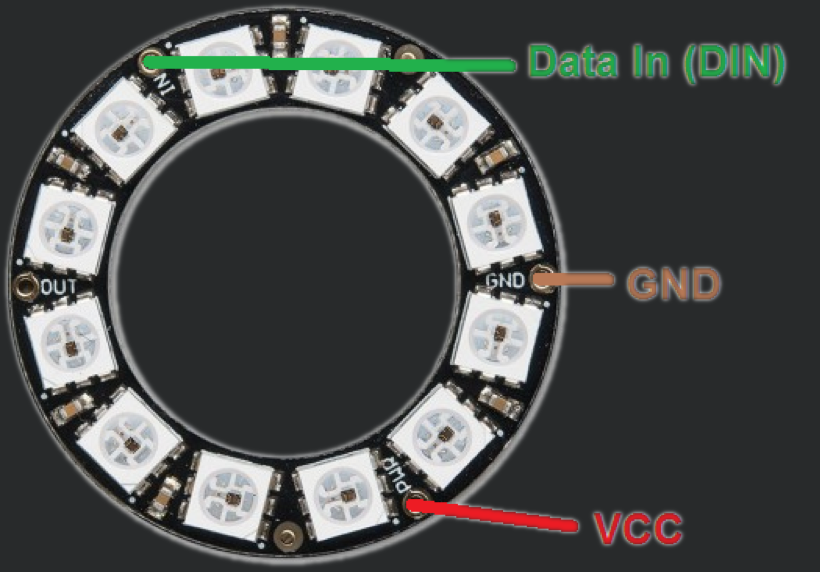
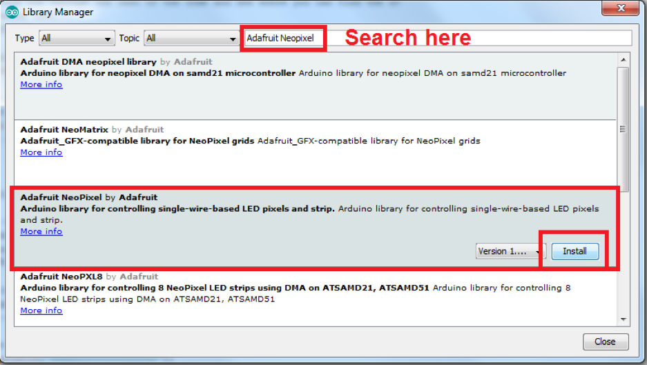

## Overview
The NeoPixel LED ring is a great tool for outputting information. All the LEDs are RGB which means you can programme them to be any colour you like! Also their ring shapes makes them great for expressing scales of things like volume, intensity and counters. 

## Wiring
To wire the LEDs up we have to connect the power supply and the connections that are used to send data between the LED ring and the Arduino. 

**REMEMBER! ALWAYS DISCONNECT THE ARDUINO FROM THE PC WHEN CHANGING WIRES.**

The following table shows the connections you need to make:

| NeoPixel LEDs | Arduino |
| ------------- | ------- |
| Data In (DIN) | Pin 6   |
| GND           | GND     |
| 5V            | 5V      |

## Getting Ready To Code

First we need to install the library for the sensor if it is not already installed. To do this open the Library Manager by clicking “Sketch>Include Library>Manage Libraries…”

Using the search box in the top right hand corner of the window that has popped up search for “Adafruit NeoPixel”. It may already be installed but if not click the install button. Note it is not the first option make sure you install the library indicated in the image below. 

Once this is all installed you can now download the demo code from our website and begin working out how to get some cool LED patterns! 

We have two tutorial codes. Start with the single LED to get used to how the system works and then move onto lighting all the LEDs up with a for loop.

***

Congrats! You are now ready to tackle the tutorial code.

<button class="mdc-button mdc-button--raised">
  <a href="./code/singleLEDTutorial.ino" class="mdc-button__label">Download the Code (Single LED)</a>
</button> 
 
 
<button class="mdc-button mdc-button--raised">
  <a href="./code/allLEDsTutorial.ino" class="mdc-button__label">Download the Code (All LEDs)</a>
</button>

***