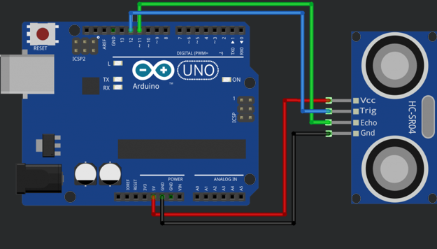
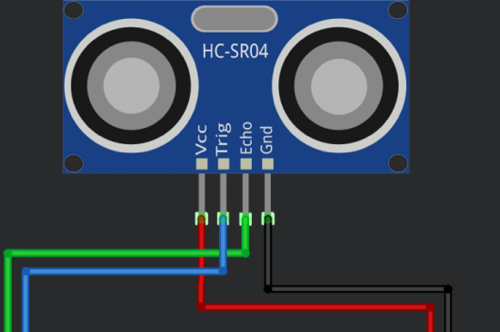
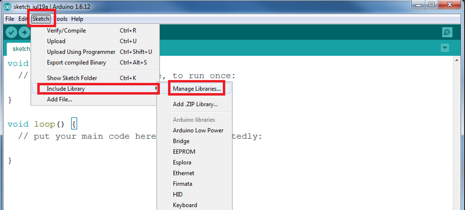
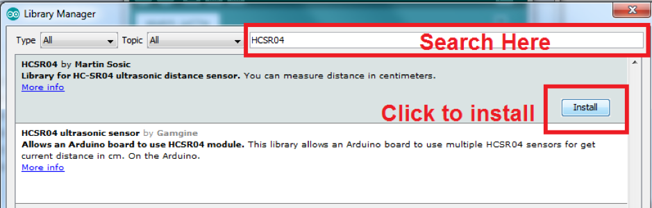

## Overview
The HC-SR04 is a sensor used to measure distance. It is able to do so using ultrasonic pulses.

## Wiring
Follow the next schematic diagram to wire the HC-SR04 ultrasonic sensor to the Arduino.

The following table shows the connections you need to make:

| Ultrasonic Sensor | Arduino |
| ----------------- | ------- |
| VCC | 5V |
| Trig | Pin 11 |
| Echo | Pin 12 |
| GND | GND |

## Getting Ready To Code
First we need to install the library for the sensor if it is not already installed. To do this open the Library Manager by clicking “Sketch>Include Library>Manage Libraries…”

Using the search box in the top right hand corner of the window that has popped up search for “HCSR04”. It may already be installed but if not click the install button.

***

Congrats! You are now ready to tackle the tutorial code.

<button class="mdc-button mdc-button--raised">
  <a href="./code/DistanceTutorial.ino" class="mdc-button__label">Download the Code</a>
</button>

***